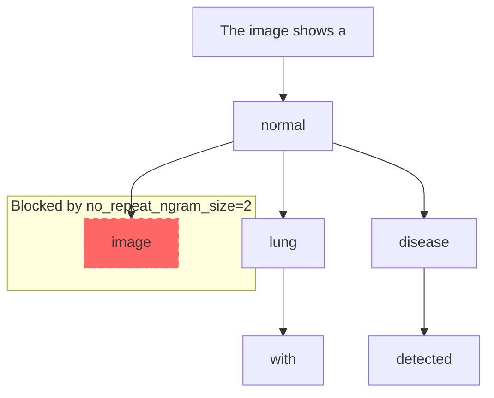

`no_repeat_ngram_size` 는 텍스트 생성에서 특정 길이의 **n-gram(연속된 토큰 시퀀스)이 반복되는 것을 방지하는 하이퍼파라미터**입니다. 이를 통해 생성된 텍스트의 다양성을 높이고, 반복적이고 부자연스러운 출력을 줄입니다.

동일한 단어 조합(the image the image)이나 구문이 반복되지 않도록 제어
특히 긴 텍스트나 대화형 응답에서 자연스러움과 가독성을 개선

## Understanding through visuals

`no_repeat_ngram_size`는 텍스트 생성 경로를 제한하는 필터로 시각화할 수 있습니다. 이미 등장한 n-gram은 이후 경로에서 차단됩니다.

- **예시**:
    - 입력 프롬프트: "The image shows a"
    - 생성 중 텍스트: "The image shows a normal"
    - no_repeat_ngram_size=2:
        - 2-gram ("The", "image"), ("image", "shows"), ("shows", "a"), ("a", "normal")이 이미 사용됨.
        - 다음 토큰 선택 시 ("normal", "image")로 이어지는 "image"는 차단됨.
    - 결과: "The image shows a normal lung" 대신 "The image shows a normal result"처럼 새로운 단어 선택.


```text
The image shows a
├── normal ── lung [허용]
├── normal ── image [차단: ("normal", "image")는 이미 ("The", "image")와 겹침]
└── disease [허용]

no_repeat_ngram_size=2: ("normal", "image") 경로 제외
```



